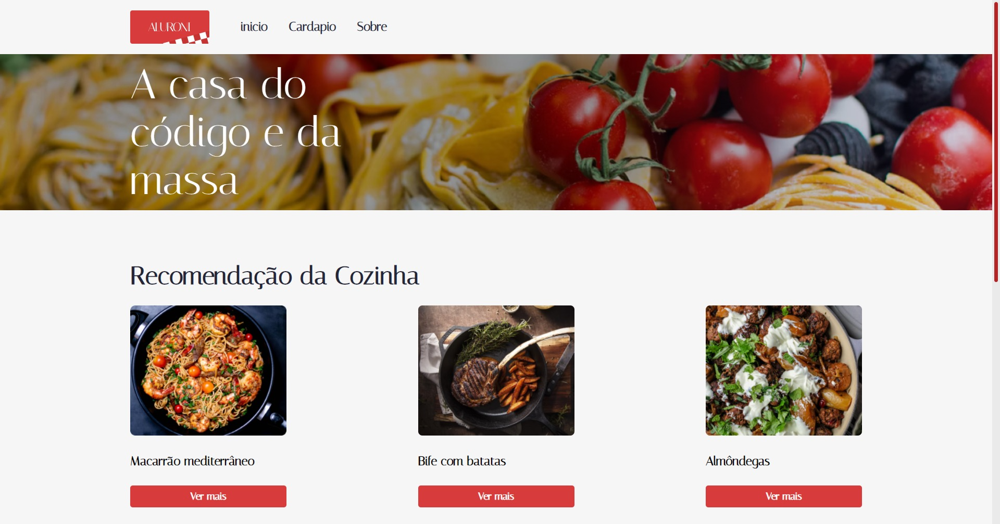
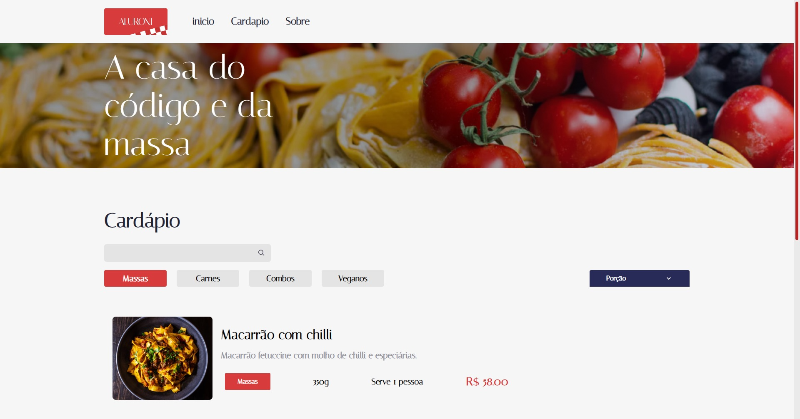
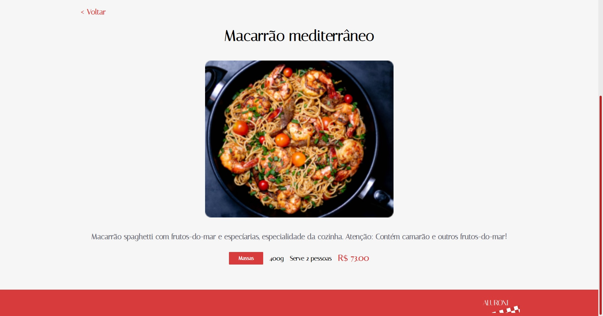
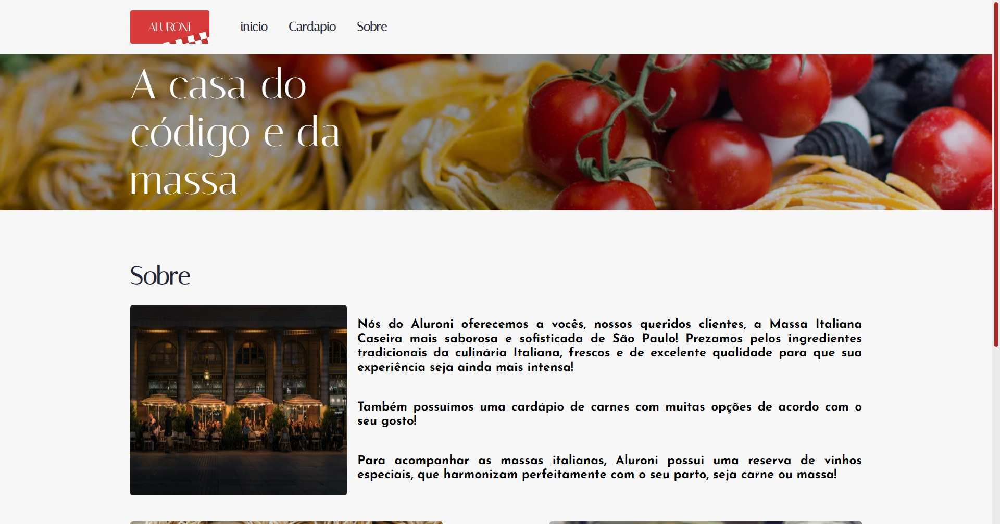

<h1 align="center">Aluroni</h1>

  

<!--  -->
</img>
</img> 
</img>
</img> 

 

## 💻 Projeto

O <b>Aluroni</b> e o web site de um restaurante para expor seu cardápio, foi desenvolvido durante o curso da alura <b>React: lidando com arquivos estáticos da Alura</b> e <b>React: conhecendo a biblioteca React Router</b>

## ✨ Tecnologias

Esse projeto foi desenvolvido com as seguintes tecnologias:

- [NodeJS](https://nodejs.org/en/)
- [TypeScript](https://www.typescriptlang.org/)
- [React](https://reactjs.org/)
- [React Router](https://v5.reactrouter.com/web/guides/quick-start)
- [SCSS](https://sass-lang.com/)
- [HTML](https://developer.mozilla.org/pt-BR/docs/Web/HTML)

## 🚀 Como executar

- Clone o repositório
- Rode `npm install` para instalar as dependências
- Rode o `npm start` para iniciar a aplicação na porta <b>3000</b>
- Por fim, a aplicação estará disponível em `http://localhost:3000`

## 📄 Licença

Esse projeto está sob a licença MIT. Veja o arquivo [LICENSE](LICENSE) para mais detalhes.